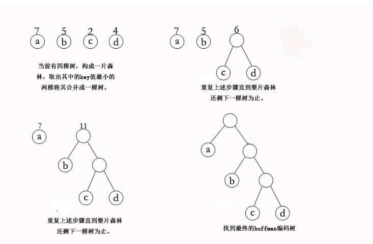

# 数据结构

## 基本概念

### 数据

对客观事物的符号表示，在计算机科学中是指，所有能输入计算机中并被计算机程序处理的符号的总称。

### 数据元素

数据的基本元素，在计算机程序中那个通常作为一个整体来考虑和研究。一个数据元素可以由若干个**数据项**组成。

### 数据对象

性质相同的数据元素的集合，是数据的一个子集。

### 数据结构

在计算机科学中，数据结构 (Data Structure) 是**计算机中存储、组织数据的方式**。

数据结构是一个二元组：

$$
DataStructure = (D,S)
$$

D 是数据元素的有限集，S 是 D 上的有限集。

数据结构意味着接口或封装：一个数据结构可被视为两个函数之间的接口，或者是由数据类型联合组成的存储内容的访问方法封装。

系统架构的关键因素是数据结构而非算法的见解，导致了多种形式化的设计方法与编程语言的出现。绝大多数的语言都带有某种程度上的模块化思想，透过将数据结构的具体实现封装隐藏于用户界面之后的方法，来让不同的应用程序能够安全地重用这些数据结构。C++、Java、Python 等面向对象的编程语言可使用类来达到这个目的。

#### 逻辑结构

数据对象中数据元素之间的相互关系。存在以下几类。

- **集合** 除了*同属于一个集合*外，没有其他关系
- **线性结构** 数据元素之间存在一对一的关系
- **树形结构** 数据元素之间存在一对多个的关系
- **图结构** 数据元素之间存在多对多的关系

#### 物理结构 (也称存储结构)

数据的逻辑结构在计算机中的存储形式。

- **顺序存储结构** 是把数据元素存放在地址连续的存储单元里，其数据间的逻辑关系和物理关系是一致的。
- **链式存储结构** 把数据元素存放在任意的存储单元里，这组存储单元可以是连续的，也可以是不连续的。数据元素的存储关系并不能反映其逻辑关系，因此需要用一个指针存放数据元素的地址，这样通过地址就可以找到相关联数据的位置。

### 抽象数据类型

抽象数据类型 (Abstract Data Type，ADT) 是计算机科学中具有类似行为的特定类别的数据结构的数学模型；或者具有类似语义的一种或多种程序设计语言的数据类型。抽象数据类型是间接定义的，通过其上的可执行的操作以及这些操作的效果的数学约束。

抽象数据类型是纯粹理论实体，用于简化描述抽象算法，分类与评价数据结构，形式描述程序设计语言的类型系统。一个 ADT 可以用特定数据类型或数据结构实现，在许多程序设计语言中有许多种实现方式；或者用形式规范语言描述。

形式上，ADT 可以使用一个三元组来描述：

$$
ADT = (D,S,P)
$$

D 是数据对象，S 是 D 上的关系集，P 是对 D 的基本操作集。

### 算法

以下是高德纳在他的著作《计算机程序设计艺术》里对算法的特征归纳：

- **输入** 一个算法必须有零个或以上输入量。
- **输出** 一个算法应有一个或以上输出量，输出量是算法计算的结果。
- **明确性** 算法的描述必须无歧义，以保证算法的实际执行结果是精确地符合要求或期望，通常要求实际运行结果是确定的。
- **有限性** 依据图灵的定义，一个算法是能够被任何图灵完全系统模拟的一串运算，而图灵机只有有限个状态、有限个输入符号和有限个转移函数(指令)。而一些定义更规定算法必须在有限个步骤内完成任务。
- **有效性** 又称可行性。能够实现，算法中描述的操作都是可以通过已经实现的基本运算执行有限次来实现。

## 线性表

### 特点

在数据元素的**非空有限集**中，

- 存在唯一一个被称为*第一个*的元素
- 存在唯一一个被称为*最后一个*的元素
- 除第一个之外，其他所有元素都有且只有一个**前趋**
- 除最后一个之外，其他所有元素有且只有一个**后继**

### 顺序存储

数组 (Array)，是**由相同类型的元素 (element) 的集合所组成的数据结构**，**分配一块连续的内存来存储**。利用元素的索 (index) 可以计算出该元素对应的存储地址。

#### 结构

```c
struct Array {
    Type* elements;
    int length;
    int size;
};
```

#### 基本操作

- 初始化
- 访问元素
- 在指定位置插入
- 在指定位置删除
- 查找

### 链式存储

链表 (Linked List) 是一种常见的基础数据结构，是一种线性表，但是并不会按线性的顺序存储数据，而是在每一个节点里存到下一个节点的指针。由于不必须按顺序存储，链表在插入的时候可以达到 $O(1)$ 的复杂度，比数组快得多，但是查找一个节点或者访问特定编号的节点则需要 $O(n)$ 的时间。

链表结构可以充分利用计算机内存空间，实现灵活的内存动态管理。但是链表失去了数组随机读取的优点，同时链表由于增加了结点的指针域，空间开销比较大。

#### 单向链表

链表中最简单的一种是单向链表，它包含两个域，一个信息域和一个指针域。这个链接指向列表中的下一个节点，而最后一个节点则指向一个空值。单向链表只可向一个方向遍历。


#### 双向链表

双向链表也叫双链表。双向链表中不仅有指向后一个节点的指针，还有指向前一个节点的指针。这样可以从任何一个节点访问前一个节点，当然也可以访问后一个节点，以至整个链表。一般是在需要大批量的另外储存数据在链表中的位置的时候用。


#### 循环链表

循环链表中第一个节点之前就是最后一个节点，反之亦然。循环链表的无边界使得在这样的链表上设计算法会比普通链表更加容易。对于新加入的节点应该是在第一个节点之前还是最后一个节点之后可以根据实际要求灵活处理，区别不大。当然，如果只会在最后插入数据，处理也是很容易的。


#### 结构

```c
struct Node {
    Type* value;
    Node* prev;
    Node* next;
};
```

#### 基本操作

- 初始化
- 访问元素
- 插入 (尾插法，头插法，任意位置插入)
- 在指定位置删除

## 队列

队列，又称为伫列(`queue`)，是先进先出(`FIFO`，`First-In-First-Out`)的线性表。在具体应用中通常用链表或者数组来实现。队列只允许在后端(称为`rear`)进行插入操作，在前端(称为`front`)进行删除操作。

队列的操作方式和堆栈类似，唯一的区别在于队列只允许新数据在后端进行添加。

### 数组队列

```c
#define MAX_QSIZE 10 // 最大队列长度+1
// 阵列队列的存储结构
struct Queue {
    int Array[MAX_QSIZE]; // 阵列空间大小
    int front; // 队头
    int rear; // 队尾
    int length; // 队列长度
};

// 构造一个空队列Q
Queue* Q_Init() {
    Queue *Q = (Queue*)malloc(sizeof(Queue));
    if (!Q){
        // 存储分配失败
        exit(OVERFLOW);
    }
    //初始化
    Q->front = Q->rear = Q->length = 0;
    return Q;
}

// 将Q清为空队列
void Q_Clear(Queue *Q) {
    //清除头尾下标和长度
    Q->front = Q->rear = Q->length = 0;
}

// 入列
int Q_Put(Queue *Q, int x) {
    //如果当前元素数量等于最大数量 返回 -1
    if (Q->rear + 1 == MAX_QSIZE) {
        return -1;
    }
    Q->Array[Q->rear] = x;
    Q->rear = Q->rear + 1;
    //length + 1
    Q->length = Q->length + 1;
    return 1;
}

// 出列
int Q_Poll(Queue *Q) {
    //如果当前元素数量等于最大数量 返回 -1
    if (Q->front + 1 == MAX_QSIZE)
        return -1;
    int x = Q->Array[Q->front];
    Q->front = Q->front + 1;
    // 移出后減少1
    Q->length = Q->length - 1;
    return x;
}
```

### 单链队列

单链队列使用链表作为基本数据结构，所以不存在伪溢出的问题，队列长度也没有限制。但插入和读取的时间代价较高。

```c
// 定义单链队列的存储结构
typedef struct QNode {
    int data;
    QNode *next;
}QNode,*QNodePtr;

typedef struct LinkQueue{
    //队头 队尾 指针
    QNodePtr front,rear;
}LinkQueue;


// 构造一个空队列Q
LinkQueue* Q_Init() {
    //申请内存
    LinkQueue* Q = (LinkQueue*)malloc(sizeof(LinkQueue));
    //如果 Q 为 NULL 说明 内存申请失败，结束程序
    if (!Q)
        exit(OVERFLOW);
    //初始化头尾节点 指向相同地址
    Q->front = Q->rear = (QNodePtr)malloc(sizeof(QNode));
    //如果 Q->front 为 NULL 说明 内存申请失败，结束程序
    if (!Q->front)
        exit(OVERFLOW);
    Q->front->next = NULL;
    return Q;
}

// 销毁队列Q(无论空否均可)
void Q_Destroy(LinkQueue *Q) {
    while (Q->front) {
        //将队尾指向队头下一个节点的地址（第1个节点）
        Q->rear = Q->front->next;
        //回收队头
        free(Q->front);
        //将队头指向队尾（相当于第1个节点变成了队头，然后依次第2个第3个、、、
        //直到没有下一个节点，也就是 Q->front == NULL 的时候）
        Q->front = Q->rear;
    }
    free(Q);
}

// 将Q清为空队列
void Q_Clear(LinkQueue *Q) {
    QNodePtr p, q;
    //将队尾指向队头点的地址
    Q->rear = Q->front;
    //取出第1个节点
    p = Q->front->next;
    //回收第1个节点
    Q->front->next = NULL;
    while (p) {
        //将 q 指向 p（第1个节点）
        q = p;
        //将 p 指向 第2个节点
        p = p->next;
        //回收第2个节点
        free(q);
    }
}

// 若Q为空队列，则返回-1，否则返回1
int Q_Empty(LinkQueue Q) {
    if (Q.front->next == NULL)
        return 1;
    else
        return -1;
}

// 求队列的长度
int Q_Length(LinkQueue Q) {
    int i = 0;
    QNodePtr p;
    p = Q.front;
    //遍历队列中的节点，直到队尾等于队头
    while (Q.rear != p) {
        i++;
        p = p->next;
    }
    return i;
}

// 打印队列中的内容
void Q_Print(LinkQueue Q) {
    int i = 0;
    QNodePtr p;
    p = Q.front;
    while (Q.rear != p) {
        i++;
        cout << p->next->data << endl;
        p = p->next;
    }
}

// 若队列不空，则用e返回Q的队头元素，并返回1，否则返回-1
int Q_GetHead(LinkQueue Q, int &e) {
    QNodePtr p;
    if (Q.front == Q.rear)
        return -1;
    p = Q.front->next;
    e = p->data;
    return 1;
}

// 插入元素e为Q的新的队尾元素
void Q_Put(LinkQueue *Q, int e) {
    QNodePtr p = (QNodePtr)malloc(sizeof(QNode));
    if (!p) // 存储分配失败
        exit(OVERFLOW);
    p->data = e;
    p->next = NULL;
    //FIFO，将新节点追加到尾节点后面
    Q->rear->next = p;
    //将新的节点变成尾节点
    Q->rear = p;
}


// 若队列不空，删除Q的队头元素，用e返回其值，并返回1，否则返回-1
int Q_Poll(LinkQueue *Q,int &e) {
    QNodePtr p;
    if (Q->front == Q->rear)
        return -1;
    //取出头节点
    p = Q->front->next;
    //取出头节点的数据
    e = p->data;
    cout << e << endl;
    Q->front->next = p->next;
    if (Q->rear == p)
        Q->rear = Q->front;
    free(p);
    cout << e << endl;
    return 1;
}
```

### 循环队列

循环队列可以更简单防止伪溢出的发生，但队列大小是固定的。

```c
// 队列的顺序存储结构(循环队列)
#define MAX_QSIZE 5 // 最大队列长度+1
typedef struct {
    int *base; // 初始化的动态分配存储空间
    int front; // 头指针，若队列不空，指向队列头元素
    int rear; // 尾指针，若队列不空，指向队列尾元素的下一个位置
} SqQueue;


// 构造一个空队列Q
SqQueue* Q_Init() {
    SqQueue *Q = (SqQueue*)malloc(sizeof(SqQueue));
    // 存储分配失败
    if (!Q){
        exit(OVERFLOW);
    }
    Q->base = (int *)malloc(MAX_QSIZE * sizeof(int));
    // 存储分配失败
    if (!Q->base){
        exit(OVERFLOW);
    }
    Q->front = Q->rear = 0;
    return Q;
}

// 销毁队列Q，Q不再存在
void Q_Destroy(SqQueue *Q) {
    if (Q->base)
        free(Q->base);
    Q->base = NULL;
    Q->front = Q->rear = 0;
    free(Q);
}

// 将Q清为空队列
void Q_Clear(SqQueue *Q) {
    Q->front = Q->rear = 0;
}

// 若队列Q为空队列，则返回1；否则返回-1
int Q_Empty(SqQueue Q) {
    if (Q.front == Q.rear) // 队列空的标志
        return 1;
    else
        return -1;
}

// 返回Q的元素个数，即队列的长度
int Q_Length(SqQueue Q) {
    return (Q.rear - Q.front + MAX_QSIZE) % MAX_QSIZE;
}

// 若队列不空，则用e返回Q的队头元素，并返回OK；否则返回ERROR
int Q_GetHead(SqQueue Q, int &e) {
    if (Q.front == Q.rear) // 队列空
        return -1;
    e = Q.base[Q.front];
    return 1;
}

// 打印队列中的内容
void Q_Print(SqQueue Q) {
    int p = Q.front;
    while (Q.rear != p) {
        cout << Q.base[p] << endl;
        p = (p + 1) % MAX_QSIZE;
    }
}

// 插入元素e为Q的新的队尾元素
int Q_Put(SqQueue *Q, int e) {
    if ((Q->rear + 1) % MAX_QSIZE == Q->front) // 队列满
        return -1;
    Q->base[Q->rear] = e;
    Q->rear = (Q->rear + 1) % MAX_QSIZE;
    return 1;
}

// 若队列不空，则删除Q的队头元素，用e返回其值，并返回1；否则返回-1
int Q_Poll(SqQueue *Q, int &e) {
    if (Q->front == Q->rear) // 队列空
        return -1;
    e = Q->base[Q->front];
    Q->front = (Q->front + 1) % MAX_QSIZE;
    return 1;
}
```

### 双端队列

双端队列(`deque`，全名`double-ended queue`)是一种具有队列和栈性质的抽象数据类型。双端队列中的元素可以从两端弹出，插入和删除操作限定在队列的两边进行。

## 栈

栈(`stack`)又称为堆叠，是一种抽象数据类型，只允许在有序的线性数据集合的一端(称为堆栈顶端`top`)进行加入数据(`push`)和移除数据(`pop`)的运算。因而按照后进先出(`LIFO`， `Last In First Out`)的原理运作。

栈常用一维数组或链表来实现。


### 特点

- 先入后出，后入先出。
- 除头尾节点之外，每个元素有一个前驱，一个后继。

### 操作

栈使用两种基本操作：

- 推入：将数据放入堆栈顶端，堆栈顶端移到新放入的数据。
- 弹出：将堆栈顶端数据移除，堆栈顶端移到移除后的下一笔数据。

### 数组栈

```c
#include <stdio.h>
#include <stdlib.h>
#include <stdbool.h>
#define stack struct Stack
#define STACK_POP_ERR 42

// 堆疊資料結構 堆栈数据结构
struct Stack {
    int val[10]; // 陣列空間
    int top;     // 堆疊頂端指標（栈顶）
};
// 檢查堆疊是否為空
bool empty(stack *stk) {
    return stk->top == 0;
}
// 推入資料
void push(stack *stk, int x) {
    stk->top = stk->top + 1;
    stk->val[stk->top] = x;
}
// 彈出并返回資料
int pop(stack *stk) {
    if (empty(stk))
        return STACK_POP_ERR; // 不能彈出
    else {
        stk->top = stk->top - 1;
        return stk->val[stk->top + 1];
    }
}
int main() {
    // 宣告并初始化資料結構空間
    stack stk;
    stk.top = 0;
    // 推入四个
    push(&stk, 3);
    push(&stk, 4);
    push(&stk, 1);
    push(&stk, 9);
    // 弹出三个
    printf("%d ", pop(&stk));
    printf("%d ", pop(&stk));
    printf("%d ", pop(&stk));
    return 0;
}
```

### 链式栈

```c
#include <stdio.h>
#include <conio.h>
#include <stdlib.h>

#define elemType int							/* 链栈元素数据类型，以整型为例 */
#define SNODE_SIZE sizeof (struct sNode)		/* 链栈结点空间大小 */

#define status int	/* 状态型变量 */
#define OVERFLOW -1	/* 内存溢出状态码 */
#define ERROR 0		/* 错误状态码 */
#define OK 1		/* 正确状态码 */

/* 链栈结点存储结构 */
typedef struct sNode {
	elemType data;
	struct sNode *next;
} sNode, *sNodePtr;

/* 链栈存储结构 */
typedef struct linkStack {
	sNodePtr top; /* 栈顶指针 */
} linkStack;

/* 初始化 */
/* 操作结果：构造一个带头结点的空链栈S */
void initStack (linkStack *S) {
	S->top = (sNodePtr) malloc (SNODE_SIZE); /* 产生头结点，栈顶指针指向此头结点 */
	if (!S->top) /* 内存分配失败 */
		exit (OVERFLOW);
	S->top->next = NULL;
}

/* 销毁 */
/* 初始条件：链栈S已存在。操作结果：销毁链栈S */
void destroyStack (linkStack *S) {
	sNodePtr p, q;

	p = S->top; /* p指向S的头结点 */
	while (p) {
		q = p->next; /* q指向p的下一个结点 */
		free (p); /* 回收p指向的结点 */
		p = q; /* p移动到下一个结点 */
	} /* 直到没有下一个结点 */
}

/* 清空 */
/* 初始条件：链栈S已存在。操作结果：将S重置为空栈 */
void clearStack (linkStack *S) {
	sNodePtr p, q;

	p = S->top->next; /* p指向栈的第一个结点 */
	while (p) {
		q = p->next; /* q指向p的下一个结点 */
		free (p); /* 回收p指向的结点 */
		p = q; /* p移动到下一个结点 */
	}  /* 直到没有下一个结点 */

	S->top->next = NULL;
}

/* 判断链栈是否为空 */
/* 初始条件：链栈S已存在。操作结果：若S为空链栈，则返回TRUE，否则返回FALSE */
status stackIsEmpty (linkStack *S) {
	return S->top->next == NULL;
}

/* 求链栈长度 */
/* 初始条件：链栈S已存在。操作结果：返回S中数据元素个数 */
int stackLength (linkStack *S) {
    int i = 0;
    sNodePtr p;

	p = S->top->next; /* p指向栈的第一个结点 */
	while (p) { /* 未到栈尾 */
		i++;
		p = p->next;
    }

    return i;
}

/* 获取栈顶元素 */
/* 初始条件：链栈S已存在。操作结果：当栈不为空时，将栈顶元素其值赋给e并返回OK，否则返回ERROR */
status getTopElem (linkStack *S, elemType *e) {
	sNodePtr p;

	if (stackIsEmpty (S))
		return ERROR;

	p = S->top->next; /* p指向栈的第一个结点 */
	*e = p->data;

	return OK;
}

/* 入栈 */
/* 操作结果：在S的栈顶插入新的元素e */
status push (linkStack *S, elemType e) {
	sNodePtr p;

	p = (sNodePtr) malloc (SNODE_SIZE); /* 产生新结点 */
	if (!p) /* 内存分配失败 */
		exit (OVERFLOW);

	p->data = e;
	p->next = S->top->next; /* 将新结点链接到原栈顶 */
	S->top->next = p; /* 栈顶指向新结点 */
}

/* 出栈 */
/* 操作结果：删除S的栈顶元素，并由e返回其值 */
status pop (linkStack *S, elemType *e) {
	sNodePtr p;

	if (stackIsEmpty (S))
		return ERROR;

	p = S->top->next; /* p指向链栈的第一个结点 */
	*e = p->data; /* 取出数据 */
	S->top->next = p->next;
	free (p); /* 删除该结点 */

    if (S->top == p) /* 栈为空 */
    	S->top->next = NULL;

    return OK;
}

/* 打印栈内容 */
/* 初始条件：链栈S已存在。操作结果：当栈不为空时，打印栈内容并返回OK，否则返回ERROR */
status printStack (linkStack *S) {
	sNodePtr p;

	if (stackIsEmpty (S))
		return ERROR;

	p = S->top->next;
	while (p) {
		printf ("%d\t", p->data);
		p = p->next;
	}
	putchar ('\n');

	return OK;
}
```

### 应用

- 回溯
- 递归
- 深度优先搜索

## 树

### 定义

树(`tree`)是一种抽象数据类型或是实现这种抽象数据类型的数据结构，用来模拟具有树状结构性质的数据集合。它是由`n`(`n>0`)个有限节点组成一个具有层次关系的集合。它具有以下的特点：

- 每个节点都只有有限个子节点或无子节点；
- 没有父节点的节点称为根节点；
- 每一个非根节点有且只有一个父节点；
- 除了根节点外，每个子节点可以分为多个不相交的子树；
- 树里面没有环路(`cycle`)。


### 术语

- **节点的度**：一个节点含有的子树的个数称为该节点的度；
- **树的度**：一棵树中，最大的节点度称为树的度；
- **叶节点**或**终端节点**：度为零的节点；
- **非终端节点**或**分支节点**：度不为零的节点；
- 父亲节点或**父节点**：若一个节点含有子节点，则这个节点称为其子节点的父节点；
- 孩子节点或**子节点**：一个节点含有的子树的根节点称为该节点的子节点；
- **兄弟节点**：具有相同父节点的节点互称为兄弟节点；
- 节点的**层**次：从根开始定义起，根为第`1`层，根的子节点为第`2`层，以此类推；
- **深度**：对于任意节点`n`，`n`的深度为从根到`n`的唯一路径长，根的深度为`0`；
- **高度**：对于任意节点`n`，`n`的高度为从`n`到一片树叶的最长路径长，所有树叶的高度为`0`；
- **堂兄弟节点**：父节点在同一层的节点互为堂兄弟；
- **节点的祖先**：从根到该节点所经分支上的所有节点；
- **子孙**：以某节点为根的子树中任一节点都称为该节点的子孙。
- **森林**：由`m`(`m>=0`)棵互不相交的树的集合称为森林；

### 分类

- 无序树：树中任意节点的子节点之间没有顺序关系，这种树称为无序树，也称为**自由树**；
- 有序树：树中任意节点的子节点之间有顺序关系，这种树称为有序树；
  - **二叉树**：每个节点最多含有两个子树的树称为二叉树；
    - **完全二叉树**：对于一颗二叉树，假设其深度为`d`(`d>1`)。除了第`d`层外，其它各层的节点数目均已达最大值，且第`d`层所有节点从左向右连续地紧密排列，这样的二叉树被称为完全二叉树；
      - **满二叉树**：所有叶节点都在最底层的完全二叉树；
    - **平衡二叉树**(`AVL`树)：当且仅当任何节点的两棵子树的高度差不大于`1`的二叉树；
      **排序二叉树**(**二叉查找树**`Binary Search Tree`)：也称二叉搜索树、有序二叉树；
  - **霍夫曼树**：带权路径最短的二叉树称为哈夫曼树或最优二叉树；
  - `B`树：一种对读写操作进行优化的自平衡的二叉查找树，能够保持数据有序，拥有多于两个子树。


### 性质

- 在二叉树的第`i`层上最多有 $2^{i-1}(i>=1)$个节点 。
- 二叉树中如果深度为`k`，那么最多有$2^k-1(k>=1)$个节点。
- 对任何非空二叉树 ，若`n0`表示度数为`0`的节点`n2`表示度数为`2`的节点,那么`n0=n2+1`。
- 具有`n`个结点的完全二叉树的深度为` log2 n + 1`


### 存储

#### 双亲表示法

假设以一组连续的空间存储树的节点，同时在每个节点中附设一个指示器指示其双亲节点在链表中的位置。这种存储方式利用了每一个节点(除根节点外)都只有一个双亲的性质。


#### 孩子表示法

使用一个数组存储所有节点，数组中的每个元素是一个链表，存储该节点的所有子节点。


#### 孩子兄弟表示法

对于树的每一个节点，其左孩子是该节点的第一个孩子节点，右孩子是下一个兄弟节点。


#### 完全二叉树的存储

<font style="color:pink">使用顺序存储结构，对完全二叉树这种结构是非常合适的。</font>可以按照从上之下，从左至右顺序存储`n`个结点的完全二叉树的**结点父子关系**。

完全二叉树的这种存储结构，有以下特点

- 非根节点(序号`i>1`)的父节点序号数组下标是`int(i/2)`
- 结点(序号为`i`)的左孩子结点的序号是`2i`，如果`2i>n`，则没有左孩子
- 结点(序号为`i`)的右孩子结点的序号是`2i+1`，如果`2i+1>n`，则没有右孩子

一般普通的二叉树，在其空余位置补充控制，当做是完全二叉树，采用数组结构存储，但会导致存储空间的浪费。


### 遍历

树的遍历方式大致分别两种，深度优先遍历(`DFS`)和广度优先遍历(`BFS`)。

前序、中序、后序遍历属于`DFS`，可以使用递归来实现，但也应该了解非递归的版本；层序遍历属于`BFS`。

#### 前序遍历

若二叉树为空，不执行任何操作；否则

- 先访问根节点
- 前序遍历左子树
- 前序遍历右子树


#### 中序遍历

若二叉树为空，不执行任何操作；否则

- 中序遍历左子树
- 访问根节点
- 中序遍历右子树


#### 后序遍历

若二叉树为空，不执行任何操作；否则

- 后序遍历左子树
- 后序遍历右子树
- 访问根节点


#### 层序遍历

按照顺序输出树的每一层节点。


### 线索二叉树

线索二叉树的定义如下：

非线性的二叉树通过以下方式转化为**线性结构**：所有原本为空的右孩子指针改为指向该节点在中序序列中的后继，所有原本为空的左孩子指针改为指向该节点的中序序列的前驱。


**线索二叉树能线性地遍历二叉树，从而比递归的中序遍历更快**。**使用线索二叉树也能够方便的找到一个节点的父节点，这比显式地使用父亲节点指针或者栈效率更高**。这在栈空间有限，或者无法使用存储父节点的栈时很有作用(对于通过深度优先搜索来查找父节点而言)。

考虑这样的例子：一个节点`k`有一个右孩子`r`，那么`r`的左指针可能是指向一个孩子节点，或是一个指回`k`的线索。如果`r`有左孩子，这个左孩子同样也应该有一个左孩子或是指回`k`的线索。对于所有的左孩子同理。因此沿着这些从`r`发出的左指针，最终会找到一个指回`k`的线索。这种特性是对称的：当`q`是`p`的左孩子时，可以沿着`q`的右孩子找到一个指回`p`的线索。

传统的二叉树一般都是以链式存储的结构来表示。这样，二叉树中的每个节点都可以用链表中的一个链节点来存储，每个链节点就包含了若干个指针。但是，这种传统的链式存储结构只能表现出二叉树中节点之间的父子关系，而且不能利用空余的指针来直接得到某个节点的在特定的遍历顺序(先序，中序，后序)中的直接前驱和直接后继。通过分析传统的二叉树链式存储结构表示的二叉树中，存在大量的空闲指针。若能利用这些空指针域来存放指向该节点的直接前驱或是直接后继的指针，则可以进行某些更方便的运算。这些被重新利用起来的空指针就被称为线索，加上了这些线索的二叉树就是线索二叉树。

**对二叉树以某种遍历顺序进行扫描并为每个节点添加线索的过程称为二叉树的线索化，进行线索化的目的是加快查找二叉树中某节点的前驱和后继的速度**。 那么在有`N`个节点的二叉树中需要利用`N+1`个空指针添加线索。这是因为在`N`个节点的二叉树中，每个节点有`2`个指针，所以一共有`2N`个指针，除了根节点以外每一个节点都有一个指针从它的父节点指向它，所以一共使用了`N-1`个指针。所以剩下`2N-(N-1) = N+1`个空指针。

### `Huffman`树

霍夫曼树又称最**优二叉树**，是一种带权路径长度最短的二叉树。所谓树的带权路径长度，就是树中所有的叶结点的权值乘上其到根结点的路径长度(若根结点为`0`层，叶结点到根结点的路径长度为叶结点的层数)。树的路径长度是从树根到每一结点的路径长度之和，记为`WPL=(W1*L1+W2*L2+W3*L3+...+Wn*Ln)`，`N`个权值`Wi(i=1,2,...,n)`构成一棵有`N`个叶结点的二叉树，相应的叶结点的路径长度为`Li(i=1,2,...,n)`。可以证明霍夫曼树的`WPL`是最小的。

**`Huffman`算法**

假设有`n`个权值，则构造出的哈夫曼树有 `n `个叶子结点。 `n`个权值分别设为 `w1,w2,…,wn`，则哈夫曼树的构造规则为：

- `I.`将 `w1,w2,…，wn `看成是有 `n` 棵树的森林(每棵树仅有一个结点)；
- `II.`在森林中选出两个根结点的权值最小的树合并，作为一棵新树的左、右子树，且新树的根结点权值为其左、右子树根结点权值之和；
- `III.`从森林中删除选取的两棵树，并将新树加入森林；
- `IV.`重复步骤 `I,II`，直到森林中只剩下一棵树为止，该树即为所求的哈夫曼树



## 图

### 定义

图是由顶点和边组成的，可以无边，但至少包含一个顶点。

$$
G = (V,E)
$$

`V`代表图中节点的集合，`E`代表图中边或是关系的集合。

**稠密图**：图中`E`的条数接近$V^2$也就是，接近任意两点之间相连。
**稀疏图**：图中`E`的条数远小于$V^2$。

### 分类

图可以分为**有向图**和**无向图**，在图中：

- `(v, w) `表示无向边，即 `v` 和 `w` 是互通的
- `<v, w>` 表示有向边，该边始于` v`，终于` w`

图可以分为**有权图**和**无权图**：

- 有权图：每条边具有一定的权重`(weight)`，通常是一个数字
- 无权图：每条边均没有权重，也可以理解为权重都相同

图又可以分为**连通图**和**非连通图**：

- 连通图：所有的点都有路径相连
- 非连通图：存在某两个点没有路径相连

### 术语

图中的顶点有度的概念：

- 度(`Degree`)：所有与它连接点的个数之和
- 入度(`Indegree`)：存在于有向图中，所有接入该点的边数之和
- 出度(`Outdegree`)：存在于有向图中，所有接出该点的边数之和

### 表示

#### 邻接矩阵

使用一个`V×V`的二位数组`ve`表示矩阵，假设`i`节点于`j`节点连通，那么`ve[i][j]=1`。
邻接矩阵可以表示有向图，和有权重图：`ve[j][i]=3`表示`j -> i`权重为`3`。

- 在 `n` 个顶点的图需要有一个 `n × n `大小的矩阵
- 在一个无权图中，矩阵坐标中每个位置值为 `1` 代表两个点是相连的，`0` 表示两点是不相连的
- 在一个有权图中，矩阵坐标中每个位置值代表该两点之间的权重，`0` 表示该两点不相连
- 在无向图中，邻接矩阵关于对角线相等

**优点**

- 对于稠密图能够有效的节省空间。
- 表示上很直观，容易判断出那两点之间相连。

**缺点**

- 在矩阵生成时，节点个数就已经确定，只能添加边，不能再添加节点。
  如果要添加节点，那么需要重新分配矩阵，代价大。
- 对于稀疏图，浪费空间。
- 在某些算法的时候需要为节点保存额外信息的时候，需要使用额外的容器

#### 邻接链表

使用一个结构体来表示每个节点：

```cpp
struct Node
{
  int ket;
  Node to;
  //..其他信息
}
```

其中`to`变量指向链接该节点`i`指向的第一个节点`j`，然后`j`节点中的`to`指向`i`节点指向的第二个节点，以此类推。
邻接矩阵表示的方法灵活方便，能够临时添加节点和边。
表示有向图，有权重图，还可以根据算法，添加不同的变量。但同时也增加了体积。

- 对于每个点，存储着一个链表，用来指向所有与该点直接相连的点
- 对于有权图来说，链表中元素值对应着权重

**缺点**

- 稠密图中浪费空间
- 不直观，在有向图中如果要同时表示指向本节点的节点，和本节点指向的节点，需要额外的一个字段。

#### 示意图

##### 无向无权图


##### 无向有权图


##### 有向有权图


#### 对比

- 邻接矩阵由于没有相连的边也占有空间，因此存在浪费空间的问题，而邻接链表则比较合理地利用空间
- 邻接链表比较耗时，牺牲很大的时间来查找，因此比较耗时，而邻接矩阵法相比邻接链表法来说，时间复杂度低。

### 遍历

#### 深度优先遍历(`Depth First Search`，`DFS`)

##### 基本思路

从图中某顶点 `v` 出发

1. 访问顶点 `v`
2. 从` v` 的未被访问的邻接点中选取一个顶点 `w`，从 `w` 出发进行深度优先遍历
3. 重复上述两步，直至图中所有和`v`有路径相通的顶点都被访问到


##### 伪代码

```java
//类似于树的先序遍历
public void DFS(Vertex V) {
    visited[V] = true;
    for(W : each adjacent potin of V) {
		if(!visited[W]) {
	    	DFS(W);
		}
    }
}
```

#### 广度优先搜索(`Breadth First Search`，`BFS`)

`BFS`需要一个队列以保持遍历过的顶点顺序，以便按出队的顺序再去访问这些顶点的邻接顶点。

##### 实现思路

1. 顶点` v` 入队列
2. 当队列非空时则继续执行，否则算法结束
3. 出队列取得队头顶点` v`；访问顶点 `v `并标记顶点`v`已被访问
4. 查找顶点 `v` 的第一个邻接顶点 `col`
5. 若 `v` 的邻接顶点 `col` 未被访问过的，则 `col` 继续
6. 查找顶点` v` 的另一个新的邻接顶点 `col`，转到步骤 `5` 入队列，直到顶点` v` 的所有未被访问过的邻接点处理完。转到步骤 `2`


### 拓扑排序

##### 是什么

图中节点视为事件，拓扑排序的目的是依据图中事件发生的先后顺序给出一个可能的排序。

图能够进行图谱排序的前提：

- 有向图：有向图才能表示两件事情之间发生的先后关系。
- 无环：也就是不存在环，如果存在的话，那么事件发生的先后关系将不确定。


##### 全序和偏序

全序指的是一个集合中**任意两个元素之间能够比较**，也就是说能够排序。

偏序指的是，集合中存在不能比较的元素(这里的不能是指的某一对之间不能，而不是该元素和其他元素不能比较)比如说，快排是一种不稳定的排序，因为两个值相同的元素之间的顺序是不稳定的。而选择排序除了比较指的大小以外，还比较了两个元素在数组中出现的顺序。

### 最小生成树(`Minimum Spanning Trees`,`MST`)

#### 提出问题

要在` n` 个城市之间铺设光缆，主要目标是要使这 `n `个城市的任意两个之间都可以通信，但铺设光缆的费用很高，且各个城市之间铺设光缆的费用不同，因此另一个目标是要使铺设光缆的总费用最低。这就需要找到带权的最小生成树。

#### 特点

- 该树是连通的
- 权值之和最小
- 边数比顶点个数少 `1`

#### 存在个数

最小生成树在一些情况下可能会有多个。

- 当图的每一条边的权值都相同时，该图的所有生成树都是最小生成树
- 如果图的每一条边的权值都互不相同，那么最小生成树将只有一个


生成最小生成树的算法一般有两种，分别是 `Prim` 算法和 `Kruskal` 算法

#### `Prim` 算法

**算法步骤**

1. 输入：一个加权连通图，其中顶点集合为 `V`，边集合为 `E`；
2. 初始化：$V_{new}= \{x\}$ ，其中 `x` 为集合 `V` 中的任一节点(起始点)，$Enew = \{\}$ (为空)；
3. 在集合 `E` 中选取权值最小的边 `<u, v>`，其中 `u` 为集合 $V_{new}$ 中的元素，而 `v `不在 $V_{new}$ 集合当中，并且 $v∈V$ (如果存在有多条满足前述条件即具有相同权值的边，则可任意选取其中之一)；
4. 将` v` 加入集合$V_{new}$中，将`<u, v>`边加入集合$E_{new}$中；
5. 重复步骤 `3`、`4 `直到 $V_{new} = V$。

时间复杂度：$O(V^2)$

#### `Kruskal` 算法

需要一个集合用来升序存储所有边。

**算法步骤**

1. 先构造一个只含有 `n` 个顶点，而边集为空的子图；
2. 从边集 `E` 中选取一条权值最小的边，若该条边的两个顶点分属不同的树，则将其加入子图。(也就是说，将这两个顶点分别所在的两棵树合成一棵树)反之，若该条边的两个顶点已落在同一棵树上，则不可取，而应该取下一条权值最小的边再试之；
3. 重复步骤 `2`，直到所有点连通。

时间复杂度：$O(Elog_2V)$

### 最短路径问题

#### `Dijkstra`算法

##### 是什么

`Dijkstra`算法是典型的单源最短路径算法，用于计算一个节点到其他所有节点的最短路径。主要特点是以起始点为中心向外层层扩展，直到扩展到终点为止。`Dijkstra`算法要求图中不存在负权边。

##### 问题描述

在无向图 `G=(V,E)` 中，假设每条边 `E[i] `的长度为 `w[i]`，找到由顶点 `V0` 到其余各点的最短路径。

##### 算法思想

设`G=(V,E)`是一个带权有向图，把图中顶点集合`V`分成两组，第一组为已求出最短路径的顶点集合(用`S`表示，初始时`S`中只有一个源点，以后每求得一条最短路径 , 就将加入到集合`S`中，直到全部顶点都加入到`S`中，算法就结束了)，第二组为其余未确定最短路径的顶点集合(用`U`表示)，按最短路径长度的递增次序依次把第二组的顶点加入`S`中。在加入的过程中，总保持从源点`v`到`S`中各顶点的最短路径长度不大于从源点`v`到`U`中任何顶点的最短路径长度。此外，每个顶点对应一个距离，`S`中的顶点的距离就是从`v`到此顶点的最短路径长度，`U`中的顶点的距离，是从`v`到此顶点只包括`S`中的顶点为中间顶点的当前最短路径长度。


##### 算法步骤

`I.`初始时，`S`只包含源点，即`S＝{v}`，`v`的距离为`0`。`U`包含除`v`外的其他顶点，即：`U=V-{v}`，若`v`与`U`中顶点`u`有边，则`<u,v>`正常有权值，若`u`不是`v`的出边邻接点，则`<u,v>`权值为`∞`。

`II.`从`U`中选取一个距离`v`最小的顶点`k`，把`k`加入`S`中(该选定的距离就是`v`到`k`的最短路径长度)。

`III.`以`k`为新考虑的中间点，修改`U`中各顶点的距离；若从源点`v`到顶点`u`的距离(经过顶点`k`)比原来距离(不经过顶点`k`)短，则修改顶点`u`的距离值，修改后的距离值的顶点`k`的距离加上边上的权。

`IV.`重复步骤`II`和`III`直到所有顶点都包含在`S`中。

示意图如下。


##### 伪代码

```cpp
function Dijkstra(G, w, s)
     for each vertex v in V[G]        // 初始化
          d[v] := infinity           // 将各点的已知最短距离先设成无穷大
          previous[v] := undefined   // 各点的已知最短路径上的前趋都未知
     d[s] := 0       // 因为出发点到出发点间不需移动任何距离，所以可以直接将s到s的最小距离设为0
     S := empty set
     Q := set of all vertices
     while Q is not an empty set      // Dijkstra算法主体
           u := Extract_Min(Q)
           S.append(u)
           for each edge outgoing from u as (u,v)
                  if d[v] > d[u] + w(u,v)     // 拓展边（u,v）。w(u,v)为从u到v的路径长度。
                        d[v] := d[u] + w(u,v)         // 更新路径长度到更小的那个和值。
                        previous[v] := u              // 纪录前趋顶点
```

#### `Floyd`算法

##### 是什么

`Floyd-Warshall`算法是解决任意两点间的最短路径的一种算法，可以正确处理有向图或负权的最短路径问题，同时也被用于计算有向图的传递闭包。`Floyd-Warshall`算法的时间复杂度为$O(N^3)$，空间复杂度为$O(N^2)$。

##### 算法思想

`Floyd`算法是一个经典的动态规划算法。换句话说，首先我们的目标是寻找从点 i 到点 j 的最短路径。从动态规划的角度看问题，我们需要为这个目标重新做一个诠释。

从任意节点`i`到任意节点`j`的最短路径不外乎`2`种可能，第一种是直接从`i`到 j，第二种是从`i`经过若干个节点`k`到`j`。所以，假设`distance(i,j)`为节点`u`到节点`v`的最短路径的距离，对于每一个节点`k`，检查`distance(i,k) + distance(k,j) < distance(i,j)`是否成立，如果成立，证明从`i`到`k`再到`j`的路径比`i`直接到`j`的路径短，就设置`distance(i,j) = distance(i,k) + distance(k,j)`，这样一来，当遍历完所有节点`k`，`distance(i,j)`中记录的便是`i`到`j`的最短路径的距离。

##### 算法步骤

`I.`从任意一条单边路径开始。所有两点之间的距离是边的权，如果两点之间没有边相连，则权为无穷大。

`II.`对于每一对顶点 `u` 和` v`，看看是否存在一个顶点 `w` 使得从 `u` 到 `w` 再到 `v` 比己知的路径更短。如果是更新它。

##### 伪代码

```cpp
let dist be a |V| × |V| array of minimum distances initialized to ∞ (infinity)
for each vertex v
	dist[v][v] ← 0
for each edge (u,v)
    dist[u][v] ← w(u,v)  // the weight of the edge (u,v)
for k from 1 to |V|
    for i from 1 to |V|
       for j from 1 to |V|
          if dist[i][j] > dist[i][k] + dist[k][j]
              dist[i][j] ← dist[i][k] + dist[k][j]
          end if
```

## 参考资料

[数据结构 - Wikipedia](https://zh.wikipedia.org/wiki/%E6%95%B0%E6%8D%AE%E7%BB%93%E6%9E%84)
